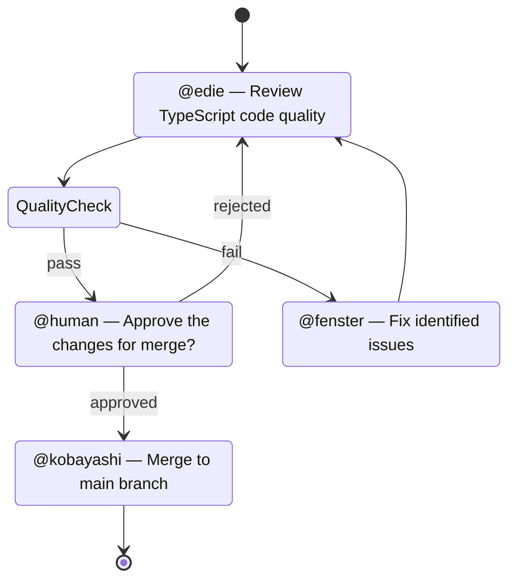
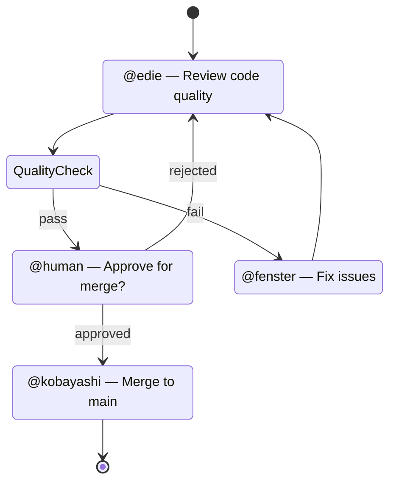

# Workflow Pipelines

Squad's workflow engine lets you define **multi-stage pipelines** using [Mermaid stateDiagram-v2](https://mermaid.js.org/syntax/stateDiagram.html) syntax. Workflows go beyond parallel fan-out — they enforce sequential stages, decision gates, human approvals, and loops.

## Quick Example

````markdown

````

This defines a pipeline where code is reviewed, quality-checked by the orchestrator, optionally fixed in a loop, approved by a human, then merged.

## Node Types

Nodes are identified by their **state description** or **stereotype**.

| Pattern in description | Node type | Behavior |
|---|---|---|
| `@agentname — task` | **Agent** | Spawns the named squad member with the task |
| `@human — prompt` | **Human** | Pauses execution, prompts user in shell |
| `<<choice>>` stereotype | **Decision** | Ralph/Orchestrator evaluates and picks a transition |
| `<<fork>>` / `<<join>>` | **Parallel** | Fan-out all branches; join waits for all |
| `state Name { ... }` | **Composite** | Sub-workflow executes as a group |

### Agent Nodes

Spawn a squad member session. The `@name` maps to a team member; the text after `—` becomes the task.

```
CodeReview : @edie — Review TypeScript code quality
```

The same agent can appear at multiple nodes — each Mermaid state has a **unique ID** (`EarlyReview` vs `FinalReview`), so there's no ambiguity.

### Decision Nodes

The orchestrator (Ralph) receives the workflow context and available transition labels, then picks one.

```
state QualityCheck <<choice>>
QualityCheck --> Approve : pass
QualityCheck --> Fix : fail
```

The orchestrator sees `[pass, fail]` and returns exactly one. This is an LLM-powered decision, not a mechanical check.

### Human-in-the-Loop Nodes

Pauses the workflow and prompts the user in the interactive shell.

```
LeadApproval : @human — Approve the changes for merge?
LeadApproval --> Merge : approved
LeadApproval --> CodeReview : rejected
```

The user sees the prompt and selects a transition label (`approved` or `rejected`).

### Parallel Nodes (Fork/Join)

Fan-out multiple branches simultaneously, then join when all complete.

```
state Fork1 <<fork>>
Fork1 --> BranchA
Fork1 --> BranchB
BranchA --> Join1
BranchB --> Join1
state Join1 <<join>>
```

## Defining Workflows

### Markdown Format (`.squad/workflows/`)

Create a markdown file in `.squad/workflows/`:

````markdown
# feature-review

Multi-stage feature review and merge pipeline.

## Trigger

type: message-pattern
pattern: review|approve|merge

## Diagram


````

### SDK-First Format (`squad.config.ts`)

```typescript
import { defineSquad, defineWorkflow } from '@bradygaster/squad-sdk';

export default defineSquad({
  // ... team, agents, routing ...
  workflows: [
    defineWorkflow({
      name: 'feature-review',
      description: 'Multi-stage feature review and merge',
      trigger: { type: 'message-pattern', pattern: 'review|approve|merge' },
      diagram: `
        stateDiagram-v2
          [*] --> CodeReview
          CodeReview : @edie — Review code quality
          ...
      `,
    }),
  ],
});
```

## CLI Commands

```bash
squad workflow list              # Show all defined workflows
squad workflow show <name>       # Display diagram and node config
squad workflow run <name>        # Start a workflow execution
squad workflow status [exec-id]  # Show execution status
squad workflow history           # List past executions
```

## Shell Commands

Inside the interactive shell:

```
/workflow list              List available workflows
/workflow run <name>        Start a workflow
/workflow status            Show active executions
```

## Triggers

| Type | Description |
|------|-------------|
| `manual` | Started via `squad workflow run` or `/workflow run` |
| `message-pattern` | Coordinator auto-triggers when user message matches regex |
| `squad-route` | Triggered by an agent via the `squad_workflow` tool |
| `schedule` | Cron-based (planned) |

## Persistence and Recovery

Workflow state is checkpointed to `.squad/workflow-runs/{execution-id}.json` after each node completes. If the process crashes, the engine can resume from the last checkpoint.

Completed runs are cleaned up automatically after 30 days.

## Agent Tool: `squad_workflow`

Agents can trigger workflows programmatically:

```
squad_workflow({ workflowName: "feature-review", context: "PR #42" })
```

This allows agents to compose workflows — for example, a lead agent could trigger a review pipeline after code generation.
